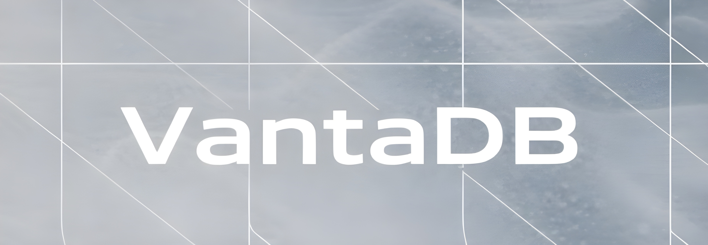

  

  <strong>A next-generation database engine built in Rust.</strong>

  <a href="https://riventa.group/vantadb">Website</a> &middot;
  <a href="#overview">Overview</a> &middot;
  <a href="#license">License</a>

  
  
  

---

## Overview

**VantaDB** is a high-performance database engine written from the ground up in Rust, developed by [Riventa Group](https://riventa.group).

Designed with speed, safety, and reliability at its core, VantaDB leverages Rust's ownership model and zero-cost abstractions to deliver a database that is both memory-safe and blazing fast.

> [!CAUTION]
> **VantaDB is currently under active development and is not ready for production use.**
> APIs, data formats, and storage layouts are subject to breaking changes without notice.

---

## License

See [LICENSE](LICENSE) for details.

---

  Built with care by <a href="https://riventa.group"><strong>Riventa Group</strong></a>

